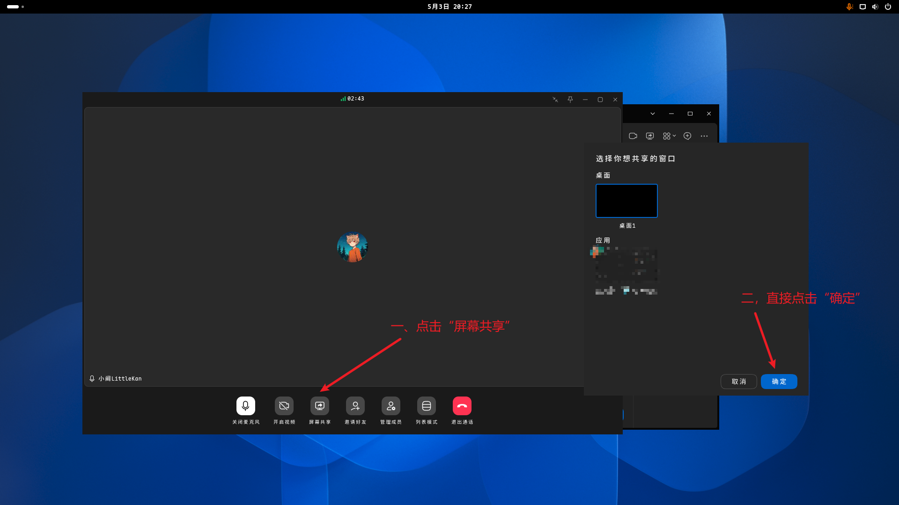
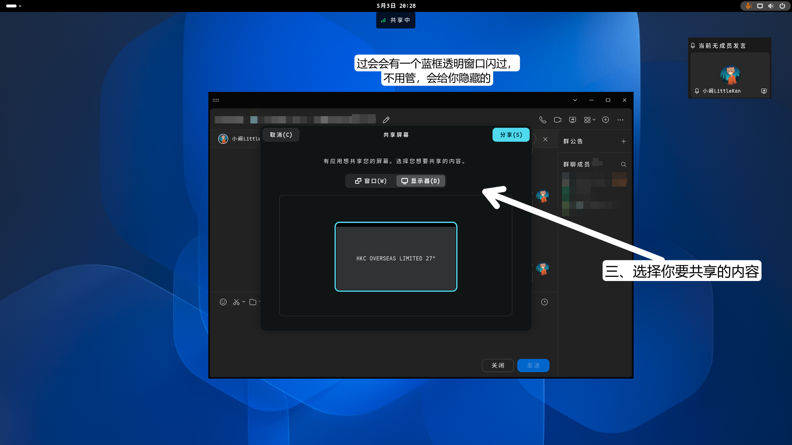
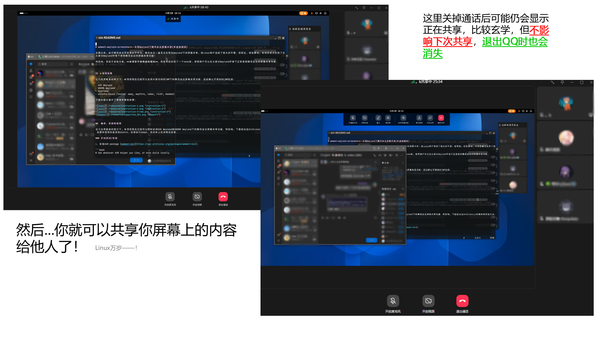

# qq-wayland-screenshare 腾讯 QQ Wayland 屏幕共享

感谢 @xuwd1 开发的 [wemeet-wayland-screenshare](https://github.com/xuwd1/wemeet-wayland-screenshare)，腾讯会议现已原生支持 Wayland 下屏幕共享。

但是，腾讯 QQ 的开发者仍然不作为，现在腾讯 QQ 仍无法实现 Wayland 下屏幕共享。本项目基于 wemeet-wayland-screenshare 的代码实现了腾讯 QQ 的 Wayland 屏幕共享。

同样地，本项目不使用虚拟相机，而是基于 XSHM 和 PipeWire 来实现屏幕共享。

> [!WARNING]
> 为方便 GitHub 上的搜索，我们将项目与上游仓库脱钩。但是，项目仍然是基于 wemeet-wayland-screenshare 开发的。
>
> 本项目尊重上游仓库作者 @xuwd1 的成果，并将同样使用 MIT 协议开源。
>
> 原仓库地址：[xuwd1/wemeet-wayland-screenshare](https://github.com/xuwd1/wemeet-wayland-screenshare)

## ✨使用效果

目前，移植后的补丁工作正常。支持的桌面环境理论上应与原项目相同。

下面的图片展示了使用步骤和效果：






## ⚒️编译、安装和使用

在几位贡献者的努力下，本项目现在已经可以同时支持KDE Wayland和GNOME Wayland下的腾讯会议屏幕共享功能. 特别地，下面给出在ArchLinux上的编译和安装方法. 如果你使用的是其他distro，还请自行adapt，但总体上应该相当容易.

### 手动测试/安装

1. 安装AUR package [linuxqq](https://aur.archlinux.org/packages/linuxqq):

```bash
# Use whatever AUR helper you like, or even build locally
yay -S linuxqq
```

2. 安装依赖

```bash
sudo pacman -S wireplumber
sudo pacman -S libportal xdg-desktop-portal xdg-desktop-portal-impl xwaylandvideobridge opencv
```

- 注意：本项目在之前的版本中必须依赖于`pipewire-media-session`. 而现在经过测试已经确定`wireplumber`下可用. 如果系统中已经安装`pipewire-media-session`，pacman会在安装`wireplumber`时提示替换，你基本可以毫无顾虑地同意替换. 关于此问题具体的implication，还请自行查阅相关资料.

3. 编译本项目:

```bash
# 1. clone this repo
git clone --recursive https://github.com/littlekan233/qq-wayland-screenshare.git
cd qq-wayland-screenshare

# 2. build the project
mkdir build
cd build
cmake .. -GNinja -DCMAKE_BUILD_TYPE=Release
ninja

```

- 编译完成后，`build`目录下可见有`libhook.so`

4. 将`libhook.so`预加载并钩住`linuxqq`:

```bash
# make sure you are in the build directory
LD_PRELOAD=$(readlink -f ./libhook.so) linuxqq
```

按照上面的使用方法，你应该可以在Wayland下正常使用腾讯会议的屏幕共享功能了！
- 注意：你需要对/usr/bin/linuxqq进行一些修改以确保能正常运行. 具体原因请见后文[兼容性和稳定性类](#兼容性和稳定性类-high-priority)部分.


5. (optional) 将`libhook.so`安装到系统目录

```bash
sudo ninja install
```
默认情况下，`libhook.so`会被安装到`/opt/QQ`下. 你随后可以相应地自行编写一个启动脚本，或者修改`linuxqq`的启动脚本，使得`libhook.so`按如上方式被预加载并钩住`qq`.

## 🔬原理概述

下面是本项目概念上的系统框图.

> 由于和 wemeet-wayland-screenshare 的原理差不多，所以这里感觉没啥大改的必要
>
> 但是还是有补充的，请耐心读下面的概述。


事实上，本项目实际上开发的是一个X11的hack，而不是wemeetapp和linuxqq的hack. 其钩住X11的`XShmAttach`,`XShmGetImage`和`XShmDetach`函数，分别实现：

- 在`XShmAttach`被调用时，hook会启动payload thread，启动xdg portal session，并进一步启动gio thread和pipewire thread，开始屏幕录制，并将frame不断写入framebuffer. 此外，一个x11 overlay sanitizer会被启动，使得X11模式下，开启屏幕共享时QQ屏幕共享的overlay（一个蓝框）被强制最小化，进而让用户的鼠标可以自由地点击包括xdg portal窗口在内的任何屏幕内容.

- 在`XShmGetImage`被调用时，hook会从framebuffer中读取图像，并将其写入`XImage`结构体中，让qq获取到正确的屏幕图像

- 在`XShmDetach`被调用时，hook会指示payload thread停止xdg portal session，并进一步join gio thread和pipewire thread，结束屏幕录制.

此外，hook同时还会劫持`XDamageQueryExtension`函数，使得上层应用认为`XDamage`扩展并未被支持，从而强迫其不断使用`XShmGetImage`获取新的完整图像.

如果你对此感兴趣，也可以进一步查阅`experiments`目录下的代码和文档，以了解更多细节.

> [!NOTE]
> 但！是！linuxqq是基于electron的，而非和wemeet一样基于qt。
>
> 所以在一些代码上做了些改动。（感谢Claude😭🙏 其实大部分代码都是claude改的~~因为我没有学过x11并且cpp也不是很精通~~）
>
> 例如，在XShmAttach上，我们不是采用的等待状态变更。因为当你点下“屏幕共享”时，XShmAttach就被调用了。所以，Claude给出了一种方案：监听宽度>=1280，高度>=720的XShmGetImage的函数call，然后尝试加载payload。（但是感觉对只捕获应用不太友好……后面会改）
>
> 但是，这也出现了一个问题————QQ的overlay（也就是蓝框）比XDG Portal先出现！那这个是怎么解决的呢？很简单————把X11 Sanitizer的启动提前，然后轮询是否有一个大小跟屏幕相等，标题为“屏幕共享”的窗口（感觉太粗暴了，后头也会改），将其强制最小化。
>
> 并且在测试的过程中，QQ还弹出过“通话出现了点小问题，窗口即将关闭，请重新进入”。这个是为什么呢？这是因为GLib/GIO需要在主线程或有GMainContext的线程中运行。然后，Claude把XdpScreencastPortal放到了主线程去创建，剩下的依旧异步处理（防止主线程堵塞~~废话~~）


## 🆘请帮帮本项目！

本项目当前还是非常实验性质的，其还有诸多不足和许多亟待解决的问题. 如果你有兴趣，欢迎向本项目贡献代码，或者提出建议！下面是一个简要的问题列表：


### 性能与效果类（Low priority）

1. framebuffer中的mutex导致的功耗偏高的问题已经在`Coekjan`的PR [#13](https://github.com/xuwd1/wemeet-wayland-screenshare/pull/13)中得到解决. 目前观察到对于[灵耀16Air(UM5606)](https://wiki.archlinux.org/title/ASUS_Zenbook_UM5606) Ryzen AI HX 370, 屏幕共享时的最低封装功耗可以低至4.7W左右，和Windows下的屏幕共享功耗基本相当.


2. opencv的链接问题已经根据`lilydjwg`的issue [#1](https://github.com/xuwd1/wemeet-wayland-screenshare/issues/1)得到了解决. 现在，借助opencv，本项目可以在保证aspect ratio不变的情况下对图像进行缩放.


### 兼容性和稳定性类 (High priority)


1. 本项目目前只在以下环境下测试过：
   - **EndeavourOS ArchLinux KDE Wayland** + `wireplumber/pipewire-media-session` 正常工作
   - **EndeavourOS ArchLinux GNOME 47 Wayland** + `wireplumber` 正常工作
   - 根据贡献者`DerryAlex`的测试结果，**GNOME 43** + `wireplumber` (Unknown distro) 正常工作
   - 根据[#4](https://github.com/xuwd1/wemeet-wayland-screenshare/pull/4)中反馈的结果，**Manjaro GNOME 47** (+ possibly `wireplumber`) 正常工作
   - 根据`falser`的反馈，**ArchLinux Hyprland** + `wireplumber`正常工作
   - 根据`novel2430`在[#9](https://github.com/xuwd1/wemeet-wayland-screenshare/issues/9)中的测试，典型的**wlroots-based DE/WM**下 (tested: sway, wayfire, labwc, river) 正常工作
   - 上述是wemeet的表现，qq的话也是都可以用的
   - **niri 用户不能直接用！** 因为 niri 的话并未完全遵守 PipeWire 标准，会导致报错`[payload pw] stream error: no more input formats`。你需要自行编译 niri 以保证正常使用屏幕共享。[怎么整捏？ ->](#-niri-环境怎么用这个库)

2. 目前，本项目只基于AUR package [wemeet-bin](https://aur.archlinux.org/packages/wemeet-bin)测试过. 特别地，在纯Wayland模式下（使用`wemeet`启动），wemeet本身存在一个恶性bug：尽管搭配本项目时，Linux用户可以将屏幕共享给其他用户，但当其他用户发起屏幕共享时，wemeet则会直接崩溃. 因此，本项目推荐启动X11模式的wemeet（使用`wemeet-x11`启动）. ~~我感觉应该不会在腾讯QQ上出现~~

- 此时，本项目仍然可以确保屏幕共享功能正常运行.
- 而这主要得益于本项目新增加的x11 sanitizer，其会在屏幕共享时强制最小化qq的overlay（开始屏幕共享后2秒后生效），使得用户可以自由地点击包括xdg portal窗口在内的任何屏幕内容.

## 🕯 niri 环境怎么用这个库？
> [!NOTE]
> 本人没试过~~因为懒~~，有误请指出
1. 克隆niri源码。

   ```bash
   git clone --recursive https://github.com/niri-wm/niri.git
   ```
2. 下载补丁并patch。

   最新的26.04版本请下载这个patch：https://github.com/wrvsrx/niri/compare/tag_support-shm-sharing_4~19..tag_support-shm-sharing_4.patch

   旧版本请查阅[此Pull Request](https://github.com/niri-wm/niri/pull/1791)。
   ```bash
   # 打上patch
   git apply /path/to/shm_support.patch
   ```
3. 编译并安装

   这边自己看 niri 的 README 吧，不做赘述了。

## 🙏致谢

- 感谢 @xuwd1 开发了 [wemeet-wayland-screenshare](https://github.com/xuwd1/wemeet-wayland-screenshare)，为我们适配腾讯 QQ 提供了参考。
- 感谢上游仓库 wemeet-wayland-screenshare 的所有贡献者。
