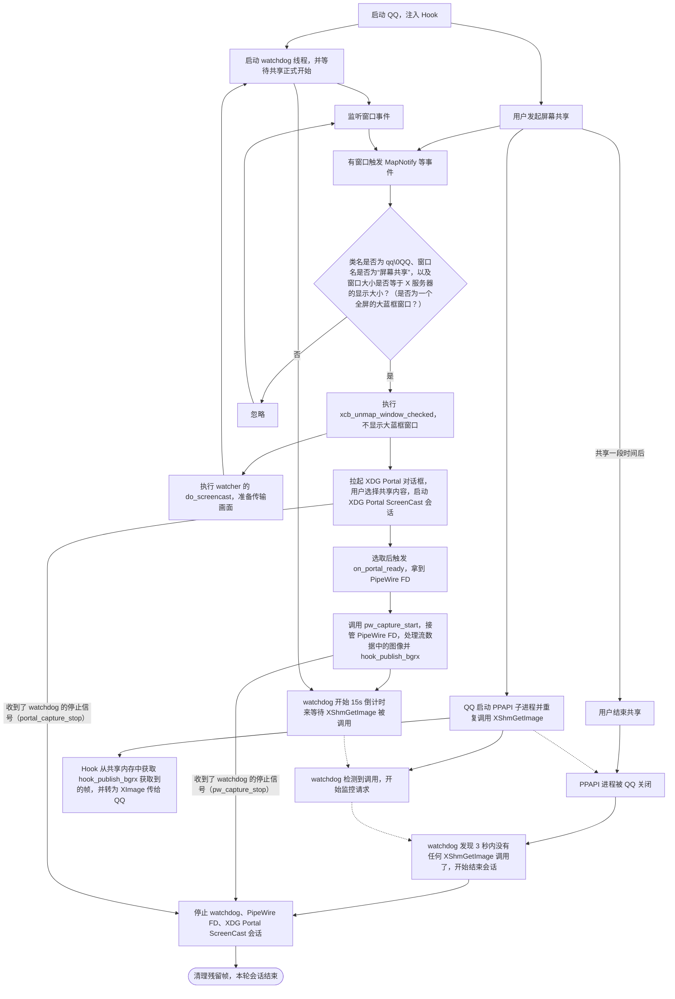

<div align="center">
  
# 🐧 qq-wayland-screenshare 🖥
在 Wayland 桌面环境下使用 QQ 屏幕共享。

</div>

> [!WARNING]
> niri 正式版目前因为 XShm 支持问题，暂不可用。
>
> 如需要在 niri 环境下使用，请考虑编译最新版本的 niri。Arch 用户可安装 [niri-git[AUR]](https://aur.archlinux.org/packages/niri-git)。
>
> **该项目目前额外依赖 libportal 库。**

## 📖 关于此项目
该项目受 [xuwd1/wemeet-wayland-screenshare](https://github.com/xuwd1/wemeet-wayland-screenshare) 启发而制作。

项目最初是基于原项目二改的，但是改着改着直接乱套了，索性推倒重来让 AI 再写一份得了（）

此项目需要通过 `LD_PRELOAD` 变量来 hook 到 QQ。

## 🚀 编译
1. 安装依赖
   Ubuntu/Debian：
   ```sh
   sudo apt update
   sudo apt install \
     build-essential cmake ninja-build pkg-config \
     libglib2.0-dev \
     libxcb1-dev libx11-dev libxext-dev \
     libportal-dev libpipewire-0.3-dev 
   ```
   Fedora/RHEL：
   ```sh
   sudo dnf install \
     gcc cmake ninja-build pkgconf-pkg-config \
     glib2-devel \
     libxcb-devel libX11-devel libXext-devel \
     libportal-devel pipewire-devel
   ```
   Arch/Manjaro：
   ```sh
   sudo pacman -S --needed \
     gcc cmake ninja pkgconf \
     glib2 \
     libxcb libx11 libxext \
     libportal libpipewire
   ```
2. 克隆仓库
   ```sh
   git clone --depth=1 https://github.com/littlekan233/qq-wayland-screenshare.git
   ```
3. 编译
   ```sh
   cd qq-wayland-screenshare
   mkdir build
   cd build
   cmake -GNinja ..
   ninja
   ```
   将会在 build 目录下生成 `libqwlss.so`。

## 📝 食用方法
在 Wayland 环境下启动 QQ 时附加 `LD_PRELOAD` 变量，并伪装成 X11 会话。
```sh
LD_PRELOAD=/path/to/libqwlss.so XDG_SESSION_TYPE=x11 /opt/QQ/qq
```
当发起屏幕共享时，请在 QQ 的选择共享内容中选择 桌面1，然后在 XDG Portal 窗口中选择你要共享的内容。

## 🤔 工作原理

```mermaid
flowchart TD
  A[启动 QQ，注入 Hook] --> B[Hook 在主进程启动窗口事件检测线程]
  A --> J[用户发起屏幕共享]
  B --> D[监听窗口事件]
  J --> E
  D --> E[有窗口触发 MapNotify 等事件]
  E --> F{类名是否为 qq\0QQ、窗口名是否为“屏幕共享”，以及窗口大小是否等于 X 服务器的显示大小？（是否为一个全屏的大蓝框窗口？）}
  F -->|是| G[执行 xcb_unmap_window_checked，不显示大蓝框窗口]
  F -->|否| H[忽略]
  H --> D
  G --> I[执行 watcher 的 do_screencast，准备传输画面]
  I --> B[启动 watchdog 线程，并等待共享正式开始]
  G --> K[拉起 XDG Portal 对话框，用户选择共享内容，启动 XDG Portal ScreenCast 会话]
  K --> L[选取后触发 on_portal_ready，拿到 PipeWire FD]
  L --> M[调用 pw_capture_start，接管 PipeWire FD，处理流数据中的图像并 hook_publish_bgrx]
  M --> M2[watchdog 开始 15s 倒计时来等待 XShmGetImage 被调用]
  B --> M2
  J --> N[QQ 启动 PPAPI 子进程并重复调用 XShmGetImage]
  N --> O[watchdog 检测到调用，开始监控请求]
  M2 -.-> O
  N --> P[Hook 从共享内存中获取 hook_publish_bgrx 获取到的帧，并转为 XImage 传给 QQ]
  J -->|共享一段时间后| J2[用户结束共享]
  J2 --> Q[PPAPI 进程被 QQ 关闭]
  N -.-> Q
  Q --> R[watchdog 发现 3 秒内没有任何 XShmGetImage 调用了，开始结束会话]
  O -.-> R
  R --> S[停止 watchdog、PipeWire FD、XDG Portal ScreenCast 会话]
  M -->|收到了 watchdog 的停止信号（pw_capture_stop）| S
  K -->|收到了 watchdog 的停止信号（portal_capture_stop）| S
  S --> T([清理残留帧，本轮会话结束])
```

## 🙏 鸣谢
感谢 [xuwd1/wemeet-wayland-screenshare](https://github.com/xuwd1) 为本项目提供参考（旧版代码原本还是二改，~~被改成依托大分还不能用的旧版本~~在 legacy 分支上）

感谢 GPT 6 Astra 为该项目提供了大量代码 ~~（因为我几乎对这一块一窍不通.jpg 我边看边学的，流程图是真人推导的）~~
